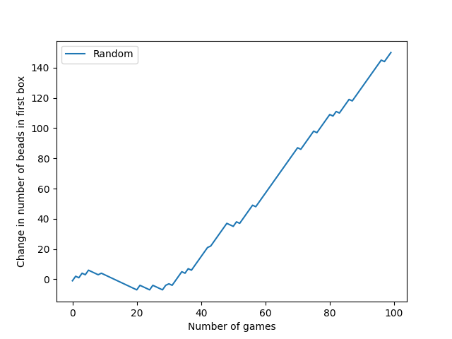
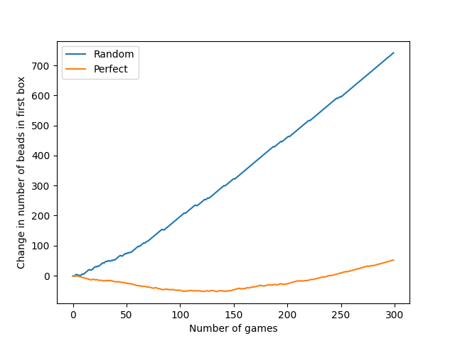
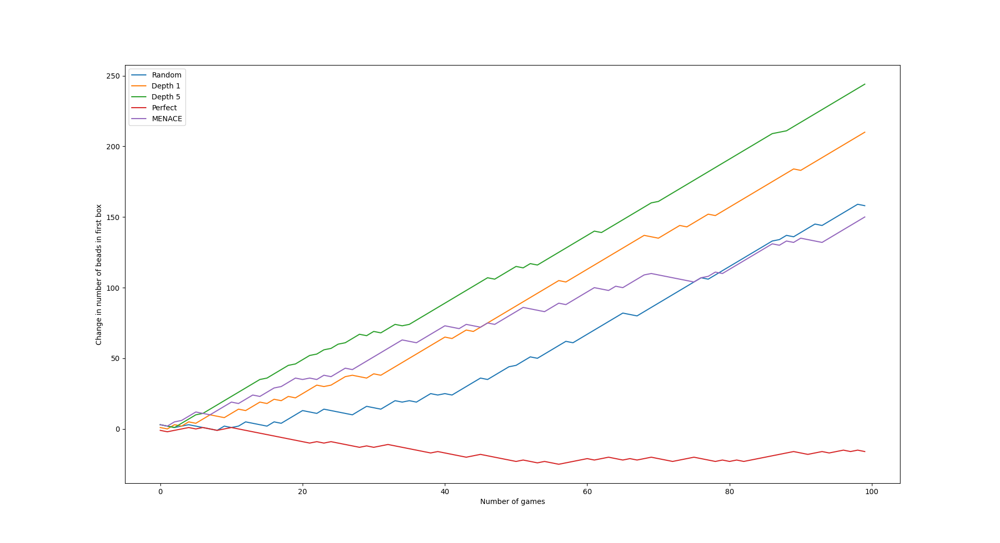
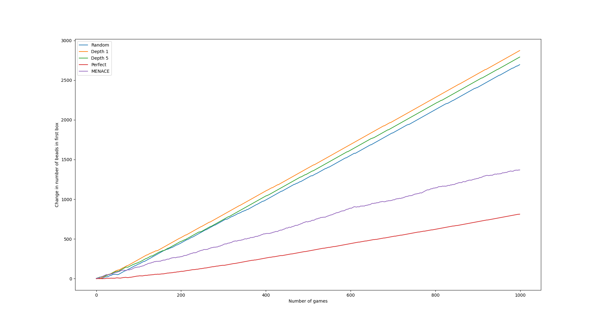

# menace

Python implementation of MENACE (Matchbox Educable Noughts And Crosses Engine)

# Contents

- [About](#about)
- [Usage](#usage)
- [Demonstration](#demonstration)
- [Requirements](#requirements)
- [Resources](#resources)

## About

The program provides a means to simulate the gameplay of the original MENACE, a mechanical artificial intelligence.

It further helps understand the basics and operations of a simple neural network and fundamental concepts like weights and reinforcement which are the core of any AI.

## Usage

```
$ python3 menace.py [mode] [trials] [-g]
```

-   `mode`: Specifies the opponent mode. Options:

    -   `-r`: random (default)
    -   `-p`: perfect
    -   `-m`: MENACE-2
    -   `-h`: human

-   `trials`: Number of games to simulate. Default is 100.

-   `-g`: Plot a graph of changes.

## Demonstration

Some interesting results can be observed when the data is visualized. Some of them are shown below.

```
$ python3 menace.py -g
```



Random vs perfect moves by opponent


Simulation of 100 games with different opponents


Simulation of 1000 games with different opponents


## Requirements

-   **Python 3**: The program is written and tested in Python 3.10. To run the program efficiently, it is recommended to use it with the latest version of Python (3.10). However, older versions might also be supported.

## Resources

You can learn more about MENACE on [Wikipedia](https://en.wikipedia.org/wiki/Matchbox_Educable_Noughts_and_Crosses_Engine)
